# 🔒 PassShield: Decoupled Serverless Password Validator

A secure, high-performance, and stateless modernization of a legacy C# command-line password validator. This project demonstrates the architectural transition of a stateful, blocking console application into a decoupled web microservice using an **Azure Functions .NET 8 Isolated Worker Process** backend and a real-time web-responsive frontend.

---

## 📁 Repository Directory Structure

This repository is structured cleanly to separate legacy console code, modern serverless endpoints, dynamic frontend modules, and visual documentation assets:

```text
Password-Validator/
│
├── Legacy Program Version1/
│   └── Program.cs                      # 2020 local C# console application
│
├── NoCommentVersion/
│   └── ValidatePassword_noComments.cs  # Uncommented C# API code
│
├── api/                                # Modernized API backend
│   ├── frontend/                       # Decoupled web interface
│   │   └── index.html                  # Responsive visual validator UI
│   ├── Program.cs                      # Host builder with telemetry bypass logic
│   └── ValidatePassword.cs             # Fully commented C# serverless API endpoint
│
├── images/                             # Verification & setup screenshots
│   ├── CORS_change_local_json.png
│   ├── UI.png
│   ├── UI_strong_password.png
│   ├── UI_weak_password.png
│   ├── code_info.png
│   ├── func_start.png
│   ├── init_net8.png
│   ├── install_funcCoreTools.png
│   ├── local_json_code1.png
│   ├── program_cscode1.png
│   ├── program_running.png
│   ├── strong_password.png
│   └── weak_password.png
│
└── README.md                           # Main repository runbook (This file)
```

---

## 🛠️ Step-by-Step Deployment & Migration Guide

### Step 1: PowerShell Terminal Session & Authentication
First, open your local terminal session and authenticate with Microsoft Azure:

```powershell
az login
```

Once logged in, navigate to the folder you are going to work out of.

---

### Step 2: Install Azure Functions Core Tools
To host and execute serverless code locally on your workstation, run the following command to configure the runtime environment variable path for `func`:

```powershell
winget install Microsoft.Azure.FunctionsCoreTools
```

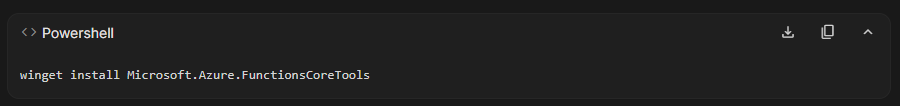

> ⚠️ **System Administrator Note:** When running these tools on a Windows system, do not use the specific `PowerShell (x64)` or `PowerShell (x86)` shortcuts. Open the standard, default **Windows PowerShell** console.

After the installation completes, restart your PowerShell terminal, navigate back to your project directory, re-authenticate with `az login`, and run the verification command to confirm the runtime tool is active:

```powershell
func --version
```

---

### Step 3: Scaffold the .NET 8 Isolated Function App
Initialize a new Azure Function application targeting the isolated-worker model inside your project root:

```powershell
func init api --worker-runtime dotnet-isolated --target-framework net8.0
```

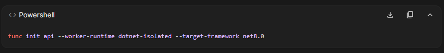

> 💡 **Version Note:** You may see a system warning during scaffolding indicating that `.NET 8 will reach end-of-life on November 09 2026 and will no longer be supported.` This is standard version lifecycle tracking in the Microsoft ecosystem and can be safely ignored.

Next, navigate into the generated folder:

```powershell
cd api
```

Generate the actual endpoint template using the HTTP trigger model:

```powershell
func new --name ValidatePassword --template "HTTP trigger" --authlevel anonymous
```

---

### Step 4: Endpoint Anatomy & Code Customization
Locate the generated `ValidatePassword.cs` file. In a modern .NET Isolated worker model, the endpoint relies on key decorative attributes:

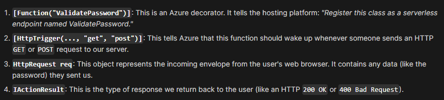

1. **`[Function("ValidatePassword")]`**: An Azure decorator registering this class as a serverless endpoint.
2. **`[HttpTrigger(..., "get", "post")]`**: Instructs Azure to execute this code whenever a web browser sends an HTTP `GET` or `POST` request to our server.
3. **`HttpRequest req`**: Represents the incoming web request envelope containing the password string sent from our client.
4. **`IActionResult`**: The standard HTTP response wrapper returned to the user (such as `200 OK` or `400 Bad Request`).

For testing flexibility, this repository hosts **two versions** of the final refactored logic:
* **`api/ValidatePassword.cs`**: The main file containing highly detailed, line-by-line developer comments explaining the C# syntax and structural upgrades.
* **`NoCommentVersion/ValidatePassword_noComments.cs`**: A clean, uncommented, production-ready codebase.

---

### Step 5: Configure Local Bypass Variables
By default, the serverless runtime expects an active storage connection string to write log telemetry. Because our validator is completely stateless, we can safely bypass this requirement.

Open **`api/local.settings.json`** and clear the connection string:

```json
{
  "IsEncrypted": false,
  "Values": {
    "AzureWebJobsStorage": "",
    "FUNCTIONS_WORKER_RUNTIME": "dotnet-isolated"
  }
}
```

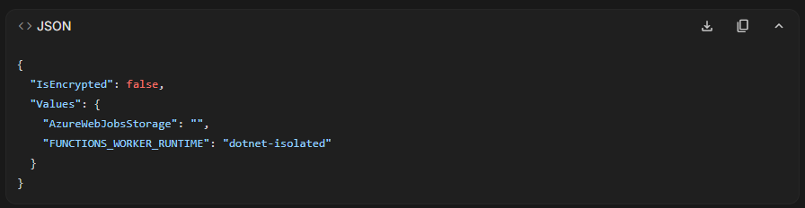

Next, we update **`api/Program.cs`** to implement dynamic telemetry bindings. This ensures our app searches for an Application Insights connection string, but skips the exporter if it is missing, preventing system crashes during local offline development:

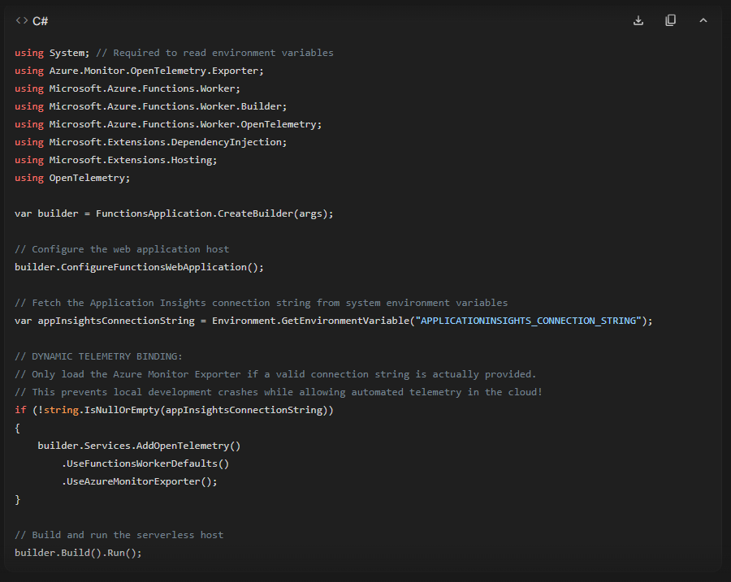

---

### Step 6: Execute the Local Serverless Host
Compile the C# code and start the local hosting engine:

```powershell
func start
```

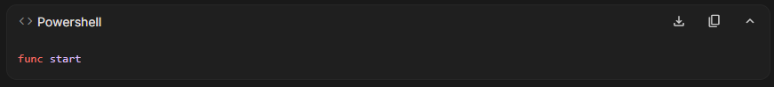

Once compiled and running, the console will expose your active local endpoint:

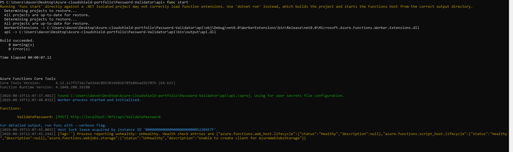

> ℹ️ **Note on Health Status:** You will see a diagnostic warning stating `Unable to create client for AzureWebJobsStorage`. This status is expected and is the desired outcome, confirming that we have bypassed local storage requirements.

---

### Step 7: Send Console Test Payloads
To test the active server, open a **second, separate** PowerShell window. You can execute these tests from any path:

#### Test A: Send a Passing Password (Returns "True")
```powershell
Invoke-RestMethod -Uri "http://localhost:7071/api/ValidatePassword" -Method Post -ContentType "application/json" -Body '{"password": "SecurePass123!"}'
```

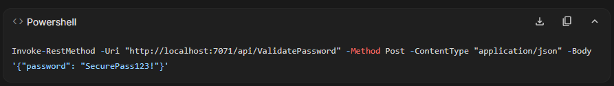

#### Test B: Send a Weak Password (Returns "False")
```powershell
Invoke-RestMethod -Uri "http://localhost:7071/api/ValidatePassword" -Method Post -ContentType "application/json" -Body '{"password": "weak"}'
```

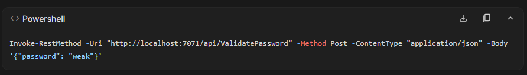

---

### Step 8: Configure CORS for Web Access
If we open a standard HTML file locally and attempt to use JavaScript to call our API, the browser will block the execution due to a **CORS (Cross-Origin Resource Sharing)** security exception.

To resolve this, we configure our API host to permit cross-origin requests. Open your **`api/local.settings.json`** file and add the `"Host"` configuration block:

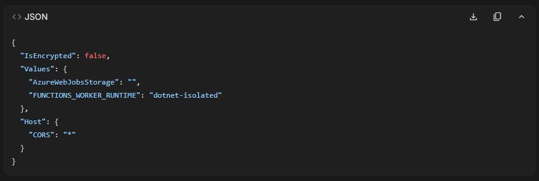

---

### Step 9: Load the Decoupled Frontend
Create a new folder inside your `api` folder named **`frontend`** (mapped to `api/frontend/`). Within that directory, create your **`index.html`** file.

Double-click `api/frontend/index.html` to open it in your browser of choice.

#### Initial Screen State (No Input Typed):
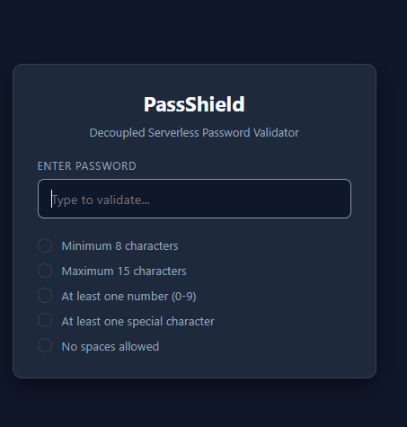

#### Live Test A: Password Meets Rules (Green Borders):
If the password meets all required constraints, the validation checklist turns green and renders checkmarks:

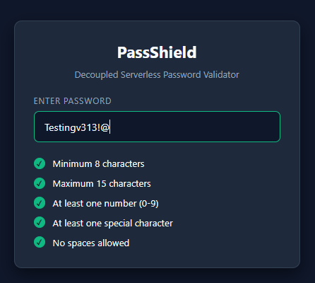

#### Live Test B: Password Fails Rules (Red Borders):
If the password violates any parameters, the border turns red and displays red cross indicators on the violated rules:

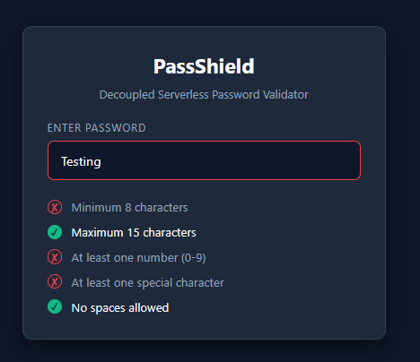

---

## 👤 Portfolio Creator
* **DaVonte' Whitfield**
* **Brand:** ScytheSoftware
* **Certifications:** Microsoft Azure Administrator (AZ-104), Network+, A+
```
